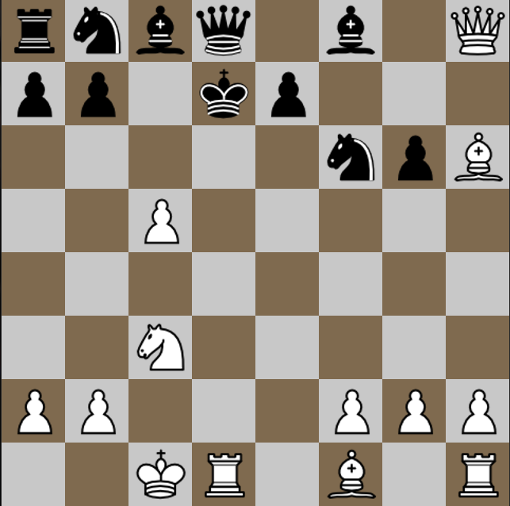
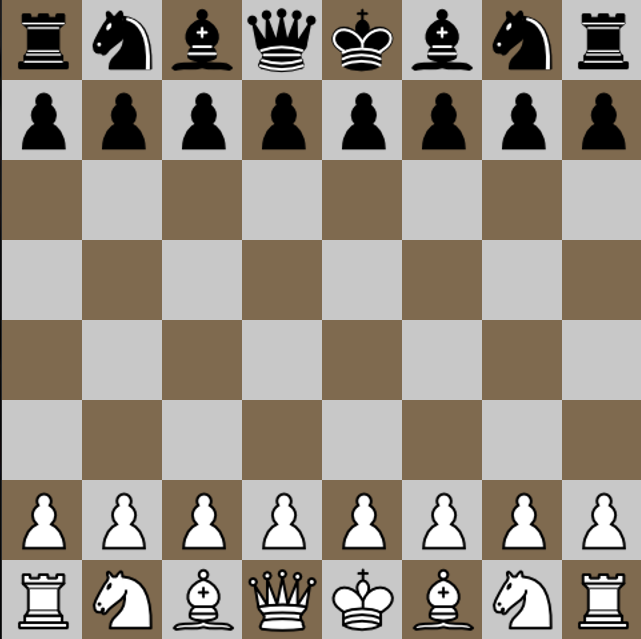

# Chess - Raylib

## Overview

A fast and simple chess game designed for all platforms. Built with performance and accessibility in mind, this implementation strips away unnecessary complexity while maintaining the pure essence of chess.

<div align="center">
    
    <p>Gameplay demonstration</p>
</div>
<div align="center">
    
    <p>Initial chess board setup</p>
</div>
## Features
- Intuitive drag-and-drop piece movement
- Smooth animations and visual feedback
- Full chess rule implementation
- Checkmate detection with victory screen
- Cross-platform compatibility

## Quick Start
```bash
git clone https://github.com/xsoder/chess.git
cd chess
sh scripts/build.sh  # or scripts\build.bat on Windows
```

For detailed build instructions, including debug and release builds, see [docs/BUILD.md](docs/BUILD.md).

## Documentation
Comprehensive documentation is available in the [docs](docs/README.md) directory:
- [Getting Started Guide](docs/GETTING_STARTED.md)
- [Architecture Overview](docs/ARCHITECTURE.md)
- [API Reference](docs/API.md)
- [Contributing Guidelines](docs/CONTRIBUTING.md)

## Controls
- Left Mouse Button: Select and move pieces
- ESC: Quit game
- ENTER: Restart game (after checkmate)

## Future Vision
- Network multiplayer support
- AI opponent implementation
- Tournament mode
- Custom themes

## License
This project is licensed under the MIT License - see the [LICENSE](LICENSE) file for details.

## Acknowledgments
- [Raylib](https://www.raylib.com/) for the graphics library


## Copyright
Copyright © 2024 [Your Name/Organization]. All rights reserved.

## Project Structure
```
chess/
├── src/             # Source files
├── header/          # Header files
├── assets/          # Game assets (images)
├── scripts/         # Build scripts
├── tests/           # Test files
└── docs/            # Documentation
```

## Contributing
Contributions are welcome! Please feel free to submit a Pull Request. For major changes, please open an issue first to discuss what you would like to change.

1. Fork the Project
2. Create your Feature Branch (`git checkout -b feature/AmazingFeature`)
3. Commit your Changes (`git commit -m 'Add some AmazingFeature'`)
4. Push to the Branch (`git push origin feature/AmazingFeature`)
5. Open a Pull Request

## Future Improvements
- Network multiplayer support
- AI opponent implementation
- Move history and game replay
- Save/Load game functionality
- Tournament mode
- Custom themes and board styles

## Changelog
For a detailed list of changes made in this project, please refer to the [CHANGELOG.md](docs/CHANGELOG.md).


